# 📊 Sales Intelligence Dashboard

> An interactive business intelligence dashboard built with **MongoDB**, **Python Dash**, and **Plotly** — transforming raw transactional sales data into actionable insights.

---

## 👥 Team

| Name | Roll No. | SAP-ID |
|------|----------|--------|
| Maitri Doshi | A066 | 60017240020 |
| Omkar Raval | A064 | 60017240010 |

**Department:** Artificial Intelligence & Machine Learning  
**Submission Date:** 17/04/2026  
**Guide:** Prof. Ragini Mishra

---

## 📌 Problem Statement

Traditional analysis of large sales datasets is often static, slow, and difficult for decision-makers to interpret quickly. This project develops an interactive Sales Intelligence Dashboard using MongoDB as the data source and Python (Dash + Plotly) for analytics and visualization.

The goal is to transform raw transactional records into actionable insights such as sales trends, profitability, customer segments, discount impact, and geographic performance.

---

## 📂 Dataset Description

- **Data Type:** Structured transactional sales data (CSV/Excel), stored in MongoDB as semi-structured documents (JSON/BSON)
- **Source Fields:** Order Date, Ship Date, Category, Sub-Category, Region, State, Segment, Sales, Profit, Quantity, Discount
- **Database Setup:** Database: `Sales` | Collection: `Analysis`

Records represent individual order-level transactions with product, customer segment, geography, and financial metrics.

---

## 🔧 Tools & Technologies

| Layer | Technology |
|-------|-----------|
| Database | MongoDB |
| Language | Python |
| Libraries | `pymongo`, `pandas`, `dash`, `plotly` |
| Visualization | Plotly Express + Plotly Graph Objects |
| Interface | Dash web application with interactive filters |

---

## 🗺️ System Workflow

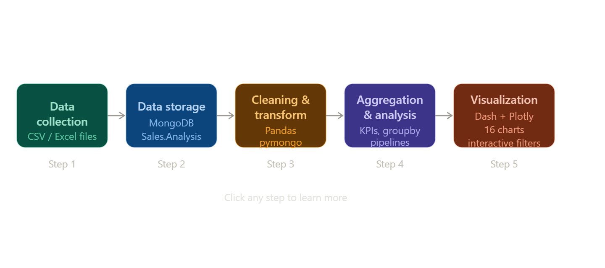

---

## ⚙️ Implementation

### MongoDB Connection & Data Fetch

```python
from pymongo import MongoClient
import pandas as pd

client = MongoClient("mongodb://127.0.0.1:27017/")
db = client["Sales"]
collection = db["Analysis"]

data = list(collection.find({}, {"_id": 0}))
df = pd.DataFrame(data)
```

### Data Cleaning

```python
df["Sales"]      = pd.to_numeric(df["Sales"],      errors="coerce")
df["Profit"]     = pd.to_numeric(df["Profit"],     errors="coerce")
df["Quantity"]   = pd.to_numeric(df["Quantity"],   errors="coerce")
df["Discount"]   = pd.to_numeric(df["Discount"],   errors="coerce")
df["Order Date"] = pd.to_datetime(df["Order Date"], errors="coerce")
df["Ship Date"]  = pd.to_datetime(df["Ship Date"],  errors="coerce")

df = df.dropna(subset=["Sales", "Profit"])
df["lead_days"]      = (df["Ship Date"] - df["Order Date"]).dt.days
df["profit_margin"]  = df["Profit"] / df["Sales"]
```

### KPI Aggregation

```python
total_sales    = df["Sales"].sum()
total_profit   = df["Profit"].sum()
total_quantity = df["Quantity"].sum()
avg_discount   = df["Discount"].mean()
overall_margin = (total_profit / total_sales) * 100 if total_sales else 0
```

### MongoDB Aggregation Pipeline — Top Categories by Sales

```python
pipeline = [
    {"$group": {"_id": "$Category", "totalSales": {"$sum": "$Sales"}}},
    {"$sort": {"totalSales": -1}}
]
result = list(collection.aggregate(pipeline))
```

### Dashboard Startup (Dash)

```python
import dash
from dash import dcc, html
import plotly.express as px

app = dash.Dash(__name__)

fig = px.bar(
    df.groupby("Category", as_index=False)["Sales"].sum(),
    x="Category", y="Sales", title="Sales by Category"
)

app.layout = html.Div([
    html.H1("Sales Intelligence Dashboard"),
    dcc.Graph(figure=fig)
])

if __name__ == "__main__":
    app.run(debug=True)
```

---

## 📊 Data Visualizations

The dashboard contains **16 interactive charts** organized across multiple tabs, built with Plotly Express and Plotly Graph Objects inside a Dash web app.

---

### 6.1 Sales by Category

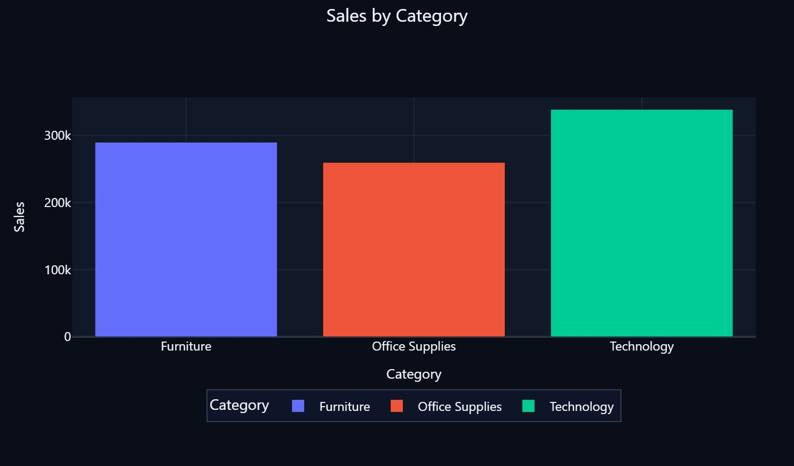

Bar chart showing total sales across Furniture, Office Supplies, and Technology categories. **Technology leads with ~$340k.**

---

### 6.2 Sales by Region

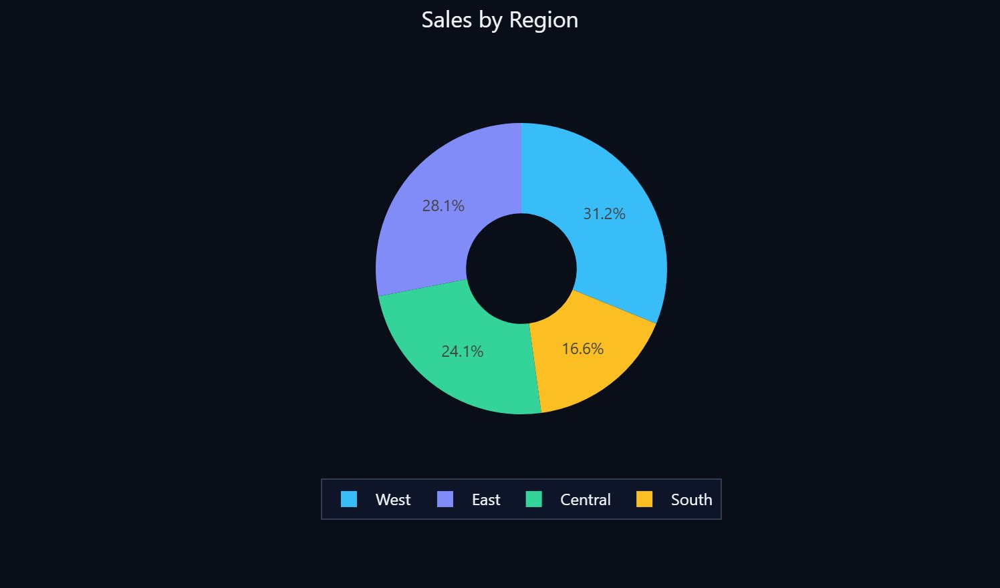

Donut chart showing regional distribution. **West leads at 31.2%**, followed by East (28.1%), Central (24.1%), and South (16.6%).

---

### 6.3 Sales vs Profit

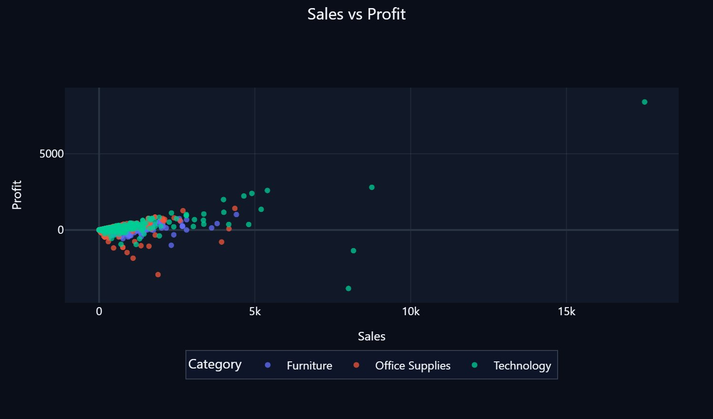

Scatter plot of Sales vs Profit by category. **Technology shows the highest individual order values and profits.**

---

### 6.4 Sales Density Heatmap

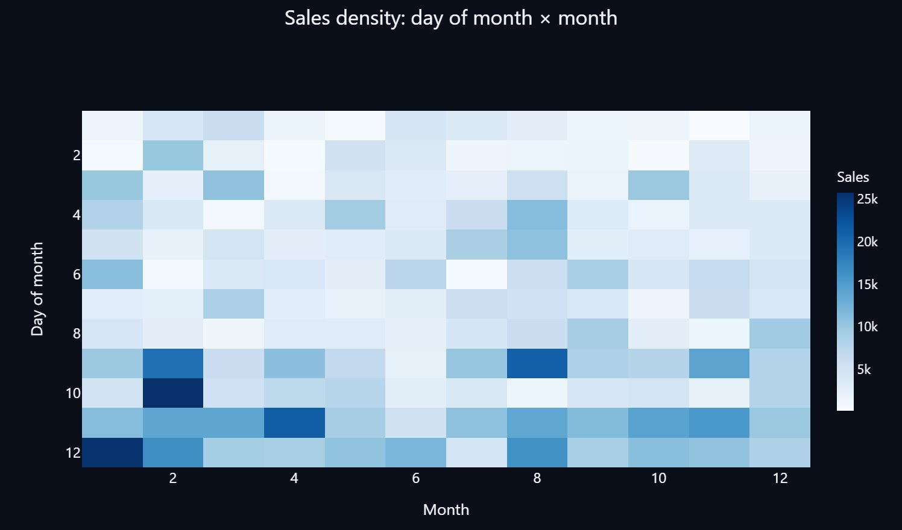

Calendar heatmap showing sales density by day-of-month and month. Peaks visible around **month-start and mid-year periods.**

---

### 6.5 Lead Time by Shipping Mode

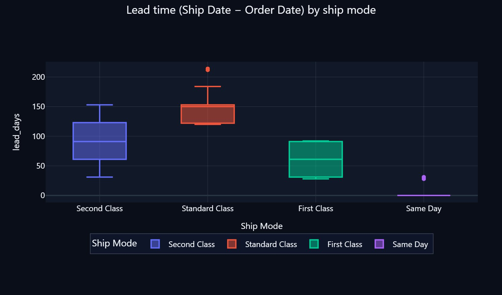

Box plot comparing lead times across shipping modes. **Standard Class has the longest lead time** (~125–175 days). Same Day delivers near 0 days.

---

### 6.6 Financial Bridge: Revenue, Costs, Net Profit

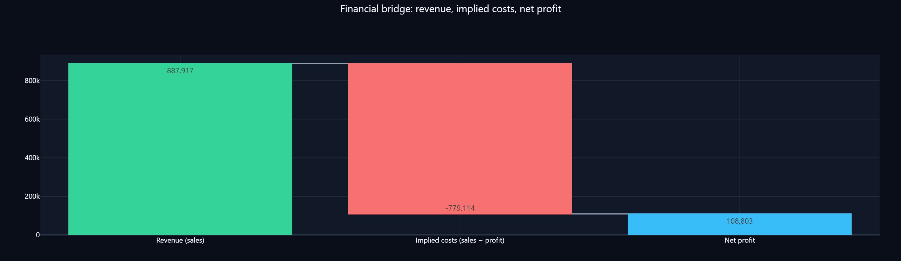

Waterfall chart showing **Revenue ($887,917)**, Implied Costs (−$779,114), and **Net Profit ($108,803).**

---

### 6.7 Profit Margin by State (Choropleth)

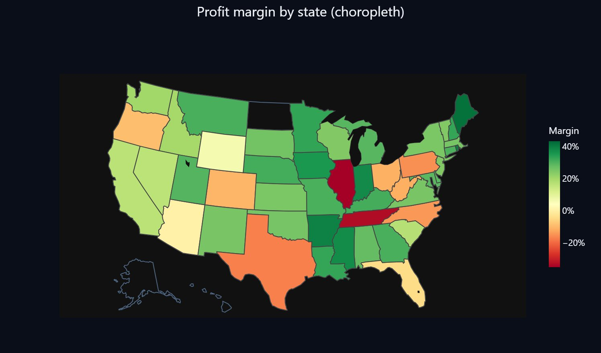

Geographic choropleth map showing profit margin per US state. **Illinois and Tennessee show negative margins (red).** Most western states are profitable (green).

---

### 6.8 Sales & Profit by State (Geo Bubble Map)

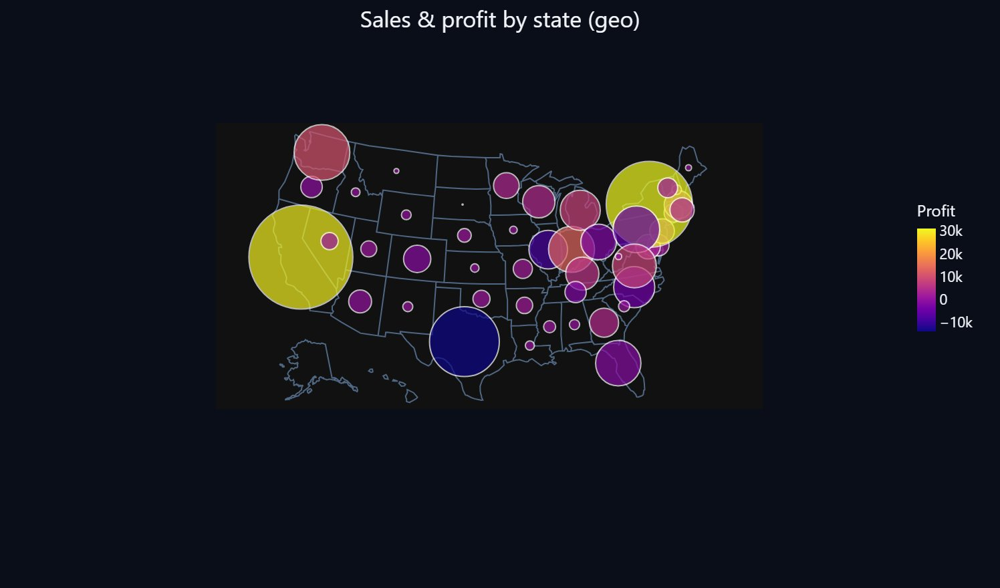

Bubble map where bubble size = total sales and color = profit. **California and New York** show high sales and profits (yellow). **Texas** shows high sales but negative profit.

---

### 6.9 Treemap: Region → State → Category

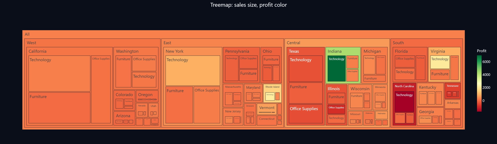

Treemap sized by Sales and colored by Profit. **Indiana shows high profitability** (green). Most of South Central (Texas) is orange/red indicating lower margins.

---

### 6.10 Sunburst: Category → Sub-Category

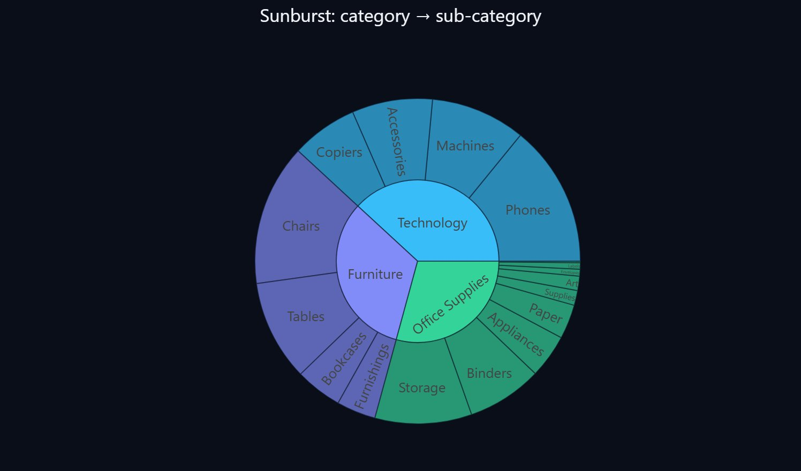

Sunburst chart showing product hierarchy across Technology (Phones, Machines, Accessories, Copiers), Furniture (Chairs, Tables, Bookcases, Furnishings), and Office Supplies (Binders, Storage, Appliances, Paper, etc.).

---

### 6.11 Pareto: Sub-Category Sales & Cumulative %

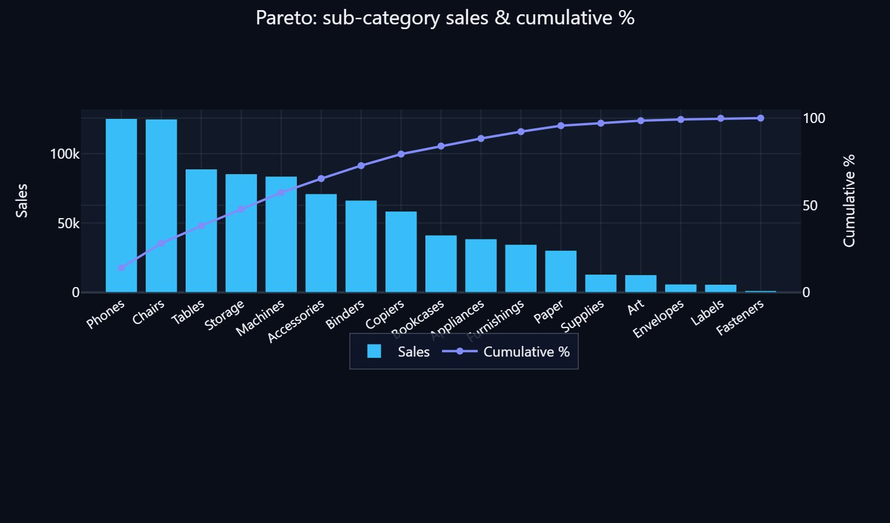

Pareto analysis showing **Phones and Chairs are the top revenue sub-categories.** The top 5 sub-categories account for approximately 50% of cumulative sales.

---

### 6.12 Parallel Coordinates (Sub-Category)

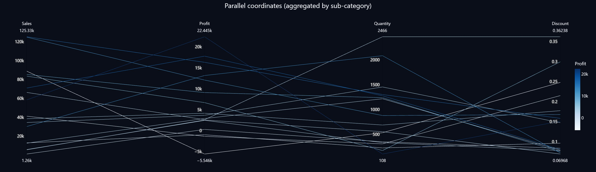

Parallel coordinates plot showing the relationship between Sales, Profit, Quantity, and Discount across sub-categories. **High-profit lines show high sales with lower discount rates.**

---

### 6.13 Stacked Monthly Sales by Customer Segment

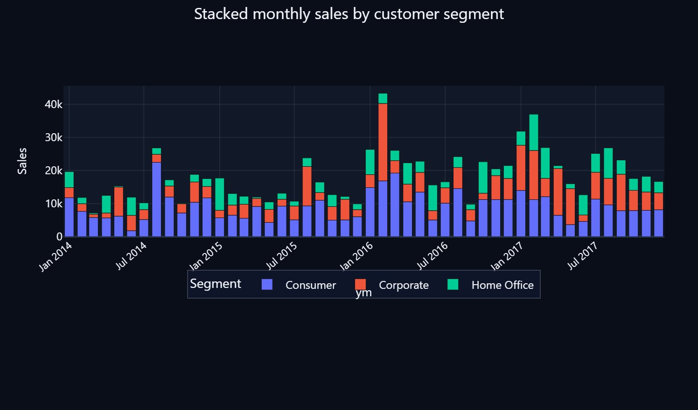

Stacked bar chart showing Consumer, Corporate, and Home Office monthly sales from 2014–2017. **Consumer segment consistently dominates.** Notable spike in Jan 2016 (Corporate).

---

### 6.14 Sales vs Profit — Bubble Size = Quantity

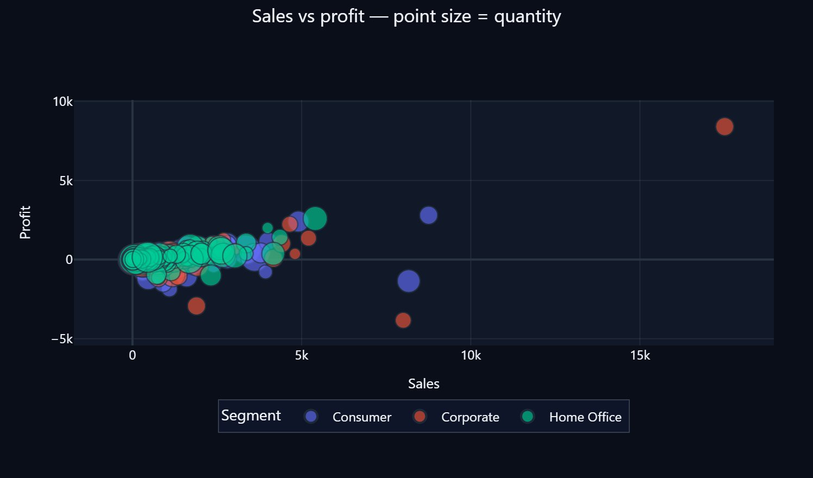

Bubble scatter chart with point size encoding quantity ordered. Large-volume Home Office transactions cluster at low sales values but spread in profitability.

---

### 6.15 Discount vs Profit Density

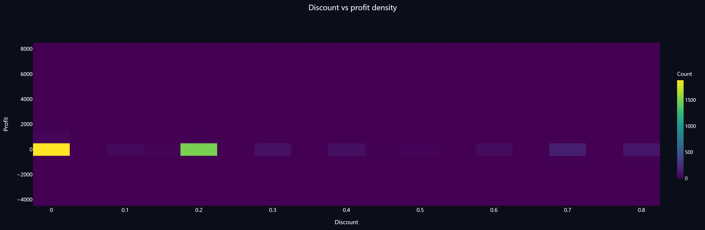

2D density heatmap of Discount vs Profit. Most transactions concentrate near **0 discount with moderate positive profit.** Higher discount bins show reduced and more negative profit concentrations.

---

### 6.16 Profit Bridge by Category (Small Multiples)

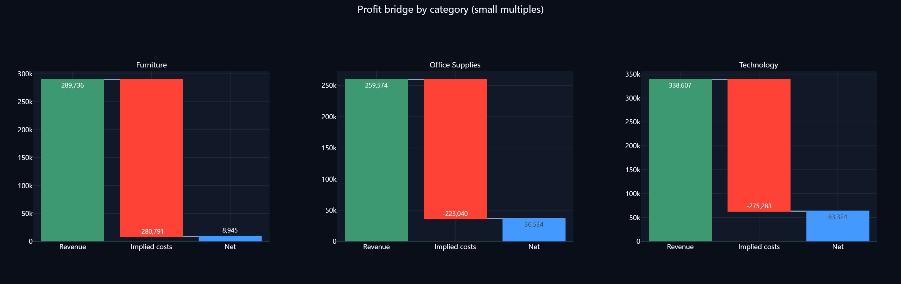

Waterfall small multiples comparing revenue, implied costs, and net profit across **Furniture ($8,945)**, **Office Supplies ($36,534)**, and **Technology ($63,324)**. Technology is the most profitable category.

---

## ✅ Conclusion

The Sales Intelligence Dashboard successfully integrates **MongoDB** with a Python-based interactive analytics pipeline to deliver a scalable and insightful business intelligence system. By combining data ingestion, cleaning, aggregation, and multi-view visualization across **16 distinct charts**, the system enables faster and more effective business decisions compared to static reporting approaches.

The dashboard clearly highlights performance disparities across:
- 📦 Product categories
- 🌍 Geographic regions
- 👥 Customer segments
- 🚚 Shipping modes

This equips decision-makers with the context needed to optimize **pricing, discounting, inventory, and logistics strategies.**

---

## 🚀 Getting Started

```bash
# 1. Clone the repository
git clone https://github.com/<your-username>/sales-intelligence-dashboard.git
cd sales-intelligence-dashboard

# 2. Install dependencies
pip install pymongo pandas dash plotly

# 3. Start MongoDB and import your dataset
# Make sure MongoDB is running on localhost:27017
# Import your CSV into the Sales.Analysis collection

# 4. Run the dashboard
python app.py
```

Then open [http://localhost:8050](http://localhost:8050) in your browser.
